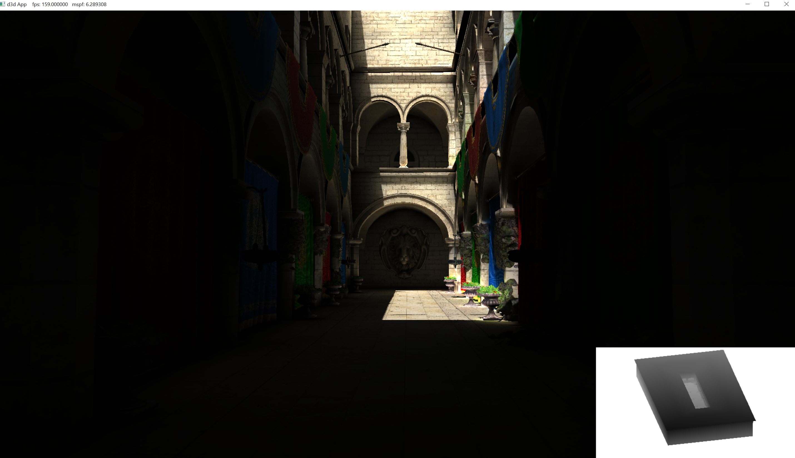
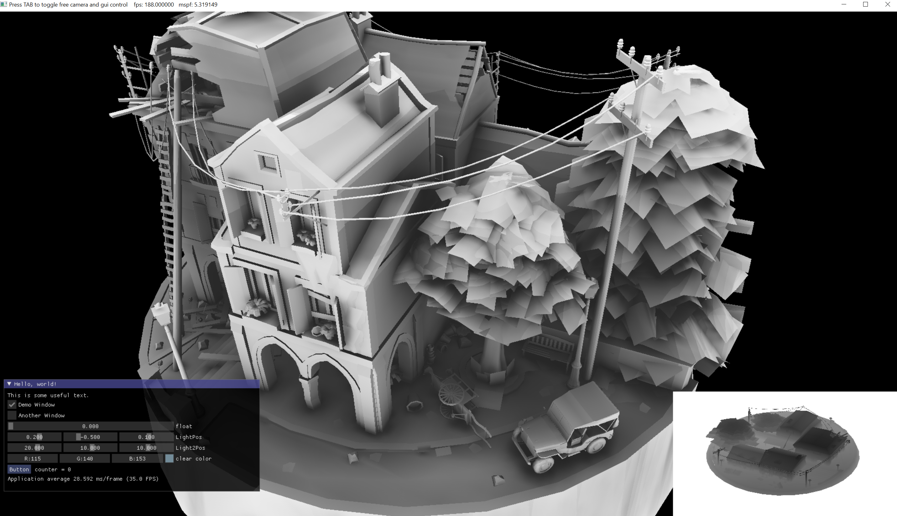
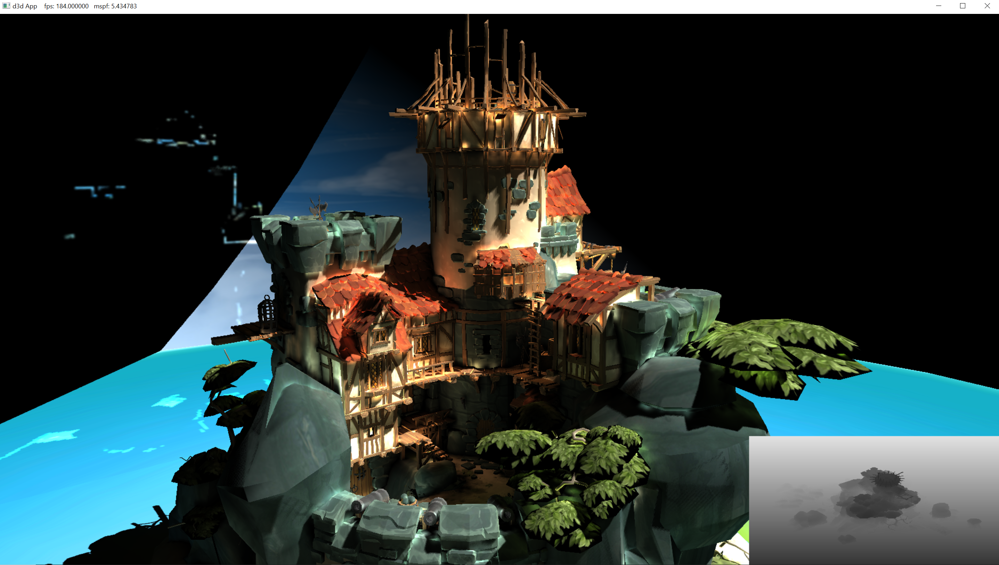

# DXE
# A voxel cone traced GI rendering engine in dx12, currently in progress

# current results

## [**Video demo**](https://www.youtube.com/watch?v=HrUgsg-X_58)

### area lighting

### voxel ambient occlusion :

### comparision
### Indirect + direct lighting

### Direct lighting only

## diffuse light only for now

### Implemented : 
 - Deferred rendering pipeline
 - Scene voxelization using hardware conservative rasterization & geometry shader
 - Radiance volume injection trough shadow map with compute dispatch thread invocation mapping to the dimension of shadowmap instead of volume
 - Anisotropic radiance volume mip map chain generation with compute shader for alleviating light leaking - a widely known issue for VCT.
 - Voxel cone tracing in a single pass conmbining previously generated geometry buffer as well as anisotropic radiance 3d texture buffer to generate final image
 - area/volume lighting
 - mutiple render layers seperating dynamic geometry and static geometry to further optimize voxelization

### Planned
 - better soft shadow from area lights
 - interleaved sampling for blocky reduction/ tiled based pixel rearrangement to improve data locality for GPU cache coherency[reference](https://www.digipen.edu/sites/default/files/public/docs/theses/sanghyeok-hong-digipen-master-of-science-in-computer-science-thesis-temporal-voxel-cone-tracing-with-interleaved-sample-patterns.pdf)
 - temporal filtering/spatial reprojection for flicker & noise reduction
 - cone traced reflection or SSR, translucent/transmissive object(subsurface scattering)
 - Clip map/cascaded mip map implementation for VCT
 - other mutiple light types using shadow map: point spot
 - cascaded/variance shadow mapping
 - render graph / more orgnized framework & RHI
 - tiled based lighting
 - DXR accelerated or hybrid GI possibly (far/medium range GI utilize Voxel/SDF, close range GI/shadow/reflection utilize DXR or SSGI, which I believe is the GI lighting tech used in UE5's PS5 demo (lumen)) ? (research)  
 - linear transformed cosine
 - DOF
 - may be experiment with SDF (signed distance field) to replace cone trace, heard they look better

## Gbuffer & deferred shawdow 

## Voxel 3d volume texture

## Voxels visulized in screen space with ray marching

## Radiance Map

# Credits
 - [Original Paper](https://research.nvidia.com/sites/default/files/pubs/2011-09_Interactive-Indirect-Illumination/GIVoxels-pg2011-authors.pdf)
 - [UE5 PS5 demo tech analysis](https://www.eurogamer.net/articles/digitalfoundry-2020-unreal-engine-5-playstation-5-tech-demo-analysis)
 - [Sketchfab : Sea Keep "Lonely Watcher"](https://sketchfab.com/3d-models/sea-keep-lonely-watcher-09a15a0c14cb4accaf060a92bc70413d)
 - [Sketchfab : WW2 Cityscene](https://sketchfab.com/3d-models/ww2-cityscene-carentan-inspired-639dc3d330a940a2b9d7f40542eabdf3)