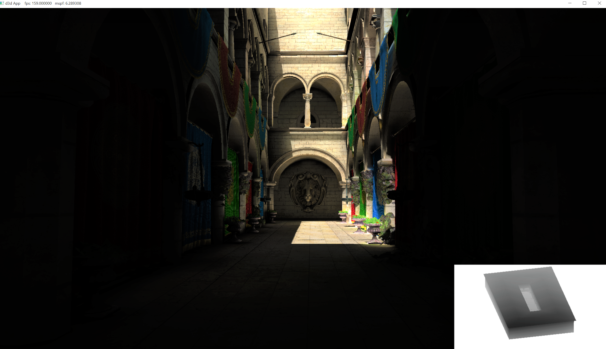
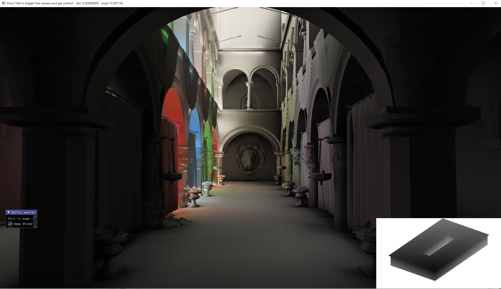
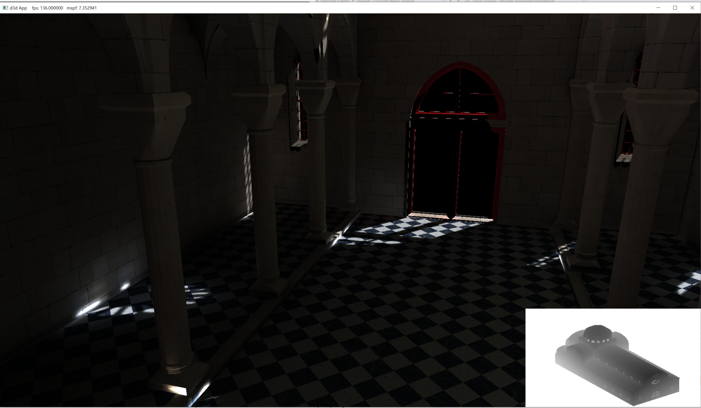
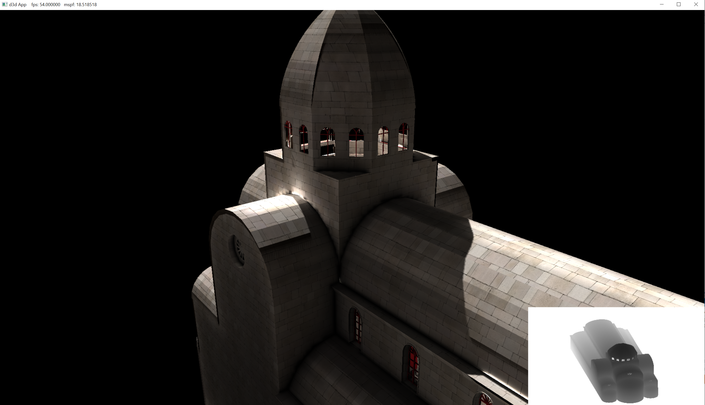

# DXE
# A voxel GI rendering engine in dx12, currently in progress

# current results

### finally got the whole pipeline working, need a lot of fixing, and the performance isn't good since no optimization have been done at all yet, but I can feel I'm getting there

## diffuse light only for now

### Implemented : 
 - Deferred rendering pipeline
 - Scene voxelization using hardware conservative rasterization & geometry shader
 - Radiance volume injection trough shadow map with compute dispatch thread invocation mapping to the dimention of shadowmap instead of volume
 - Anistropic radiance volume mip map chain generation with compute shader for preventing light leaking - a widely known issue for VCT.
 - Voxel cone tracing in a single pass conmbining previously generated geometry buffer as well as anistropic radiance 3d texture buffer to generate final image

### Planned
 - mutiple render layers seperating dynamic geometry and static geometry to further optimize voxelization
 - cone traced reflection/SSR, translucent object
 - Clip map/cascaded mip map implementation for VCT
 - area/volume lighting
 - other mutiple light types using shadow map: point spot
 - cascaded/variance shadow mapping
 - render graph / more orgnized framework & RHI
 - tiled based lighting
 - DXR accelerated VCT possibly ? (research)  
 - linear transformed cosine
 - DOF
## Gbuffer & deferred shawdow 

## Voxel 3d volume texture

## Voxels visulized in screen space with ray marching

## Radiance Map

