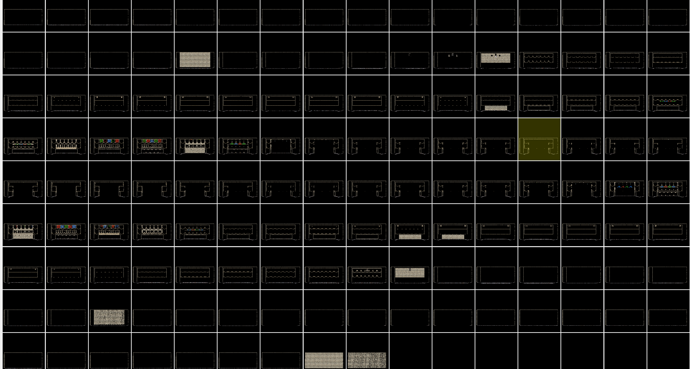

# DXE
# A voxel GI rendering engine in dx12, currently in progress

# Buggy rendering

### finally got the whole pipeline working, need a lot of fixing, and the performance isn't good since no optimization have been done at all yet, but I can feel I'm getting there

## diffuse light only for now

## Gbuffer & deferred shawdow 

## Voxel 3d volume texture

## Voxels visulized in screen space with ray marching

## Radiance Map

